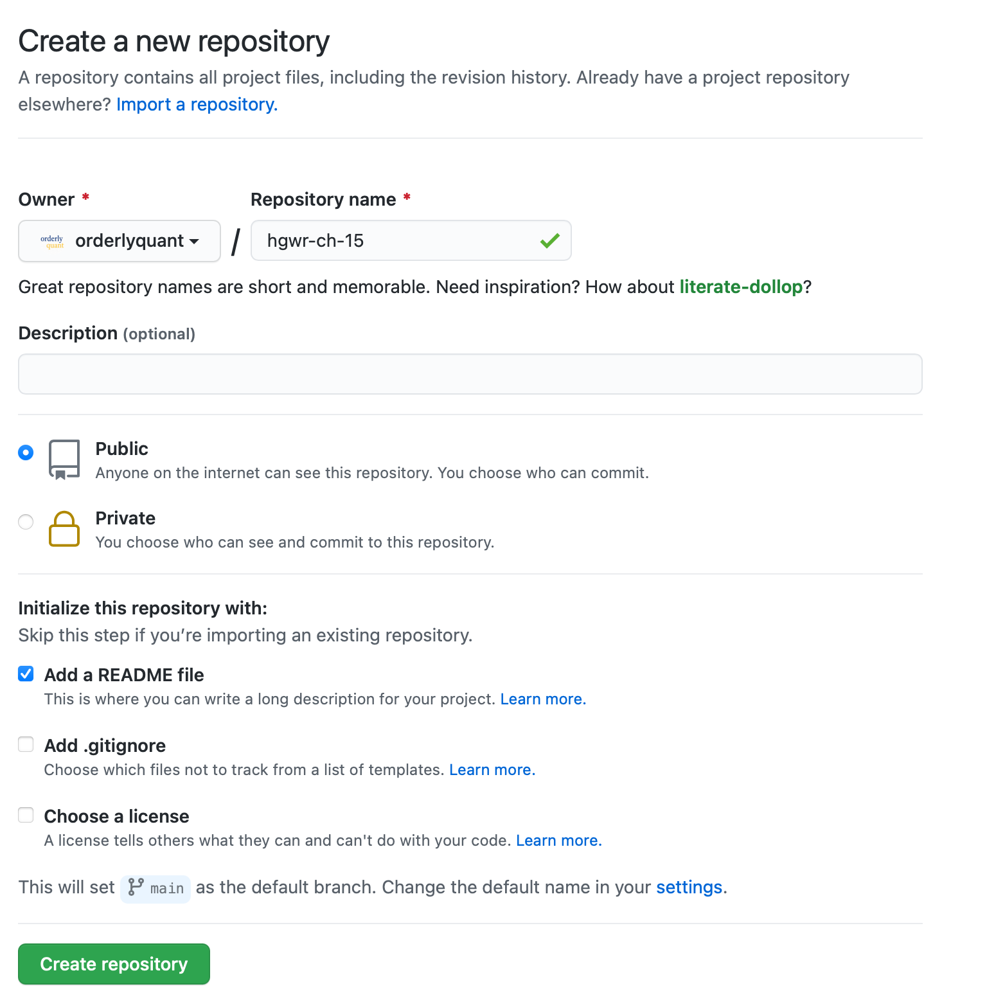

# Happy Git with R

*notes* and thoughts on [Happy Git with R](https://happygitwithr.com)

## Chapter 9 - Connect to GitHub Account

All went well.

-   Took the time to add two-factor authentication to my Github account.
-   Setup new Personal Access Token (PAT)
-   Did several repo creation, cloning and pushing tests successfully.

## Chapter 10 - Cache Credentials for HTTPS

-   decided to standardize all github.com use on HTTPS.

    -   JBryan recommendation and Github recommendation

-   downloaded and started to use
    [`credentials`](https://docs.ropensci.org/credentials/) package for
    storage and use of git PAT

-   moved the PAT from explicit store in .Renviron to credential lookup
    in .Rprofile using `credentials::credential_helper_set()`

------------------------------------------------------------------------

*skipping intervening Chapters...walked through all directions, setup is
working*

------------------------------------------------------------------------

## Chapter 15

**New project, GitHub first** is the preferred method because everything
gets setup for pushing/pulling, etc.

The standard setup for creating a new repo on github.com is:

------------------------------------------------------------------------



*note: Add a README file is checked*

------------------------------------------------------------------------

> There's a big advantage to the "GitHub first, then RStudio" workflow:
> the remote GitHub repo is added as a remote for your local repo and
> your local master branch is now tracking master on GitHub. This is a
> technical but important point about Git. The practical implication is
> that you are now set up to push and pull. No need to fanny around
> setting up Git remotes and tracking branches on the command line.

### 15.4 Push your local changes to GitHub

> This will seem counterintuitive, but first let's stop and pull from
> GitHub. Establish this habit for the future! If you make changes to
> the repo in the browser or from another machine or (one day) a
> collaborator has pushed, you will be happier if you pull those changes
> in before you attempt to push.

## Chapter 17 - Existing project, GitHub last

**Important:** this is a key workflow that's a little complicated, so
refer to the
[website](https://happygitwithr.com/existing-github-last.html).

## Chapter 18 - Test drive R Markdown

*some useful R Markdown debugging techniques*

> Tell knitr to soldier on, even in the presence of errors. Some
> problems are easier to diagnose if you can execute specific R
> statements during rendering and leave more evidence behind for
> forensic examination.


    ```{r setup, include = FALSE, cache = FALSE}
    knitr::opts_chunk$set(error = TRUE)
    ```

> If it's undesirable to globally accept errors, you can still do this
> for a specific chunk like so:


    ```{r wing-and-a-prayer, error = TRUE}
    ## your sketchy code goes here ;)
    ```

Adapt the ["git bisect" strategy](http://webchick.net/node/99):

Put `knitr::knit_exit()` somewhere early in your `.Rmd` document, either
in inline R code or in a chunk. Keep moving it earlier until things
work. Now move it down in the document. Eventually you'll be able to
narrow down the location of your broken code well enough to find the
line(s) and fix it.

> Drop these commands into R chunks to check the above:

-   `getwd()` will display working directory at run time. If you
    monkeyed around with working directory with, e.g., the mouse, maybe
    it's set to one place for your interactive development and another
    when "Knit HTML" takes over?

-   list.files() will list the files in working directory. Is the file
    you want even there?

## Chapter 22 - Branches

[This](https://happygitwithr.com/git-branches.html#dealing-with-conflicts)
is useful for solving merge conflicts. Also, see [this](https://happygitwithr.com/git-branches.html#dealing-with-conflicts}).


