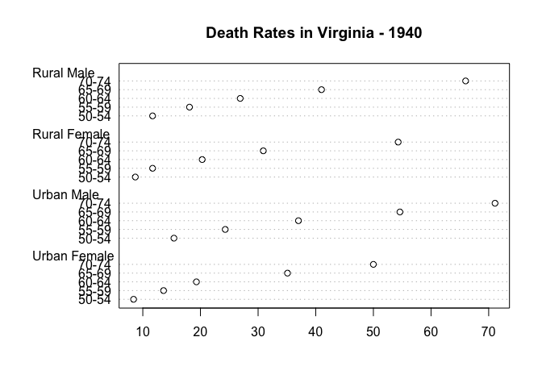

R scripts can be rendered\!
================
Jenny Bryan
April 1, 2014

Here’s some prose in a very special comment. Let’s summarize the
built-in dataset `VADeaths`.

``` r
# here is a regular code comment, that will remain as such
summary(VADeaths)
```

    ##    Rural Male    Rural Female    Urban Male    Urban Female 
    ##  Min.   :11.7   Min.   : 8.7   Min.   :15.4   Min.   : 8.4  
    ##  1st Qu.:18.1   1st Qu.:11.7   1st Qu.:24.3   1st Qu.:13.6  
    ##  Median :26.9   Median :20.3   Median :37.0   Median :19.3  
    ##  Mean   :32.7   Mean   :25.2   Mean   :40.5   Mean   :25.3  
    ##  3rd Qu.:41.0   3rd Qu.:30.9   3rd Qu.:54.6   3rd Qu.:35.1  
    ##  Max.   :66.0   Max.   :54.3   Max.   :71.1   Max.   :50.0

Here’s some more prose. I can use usual markdown syntax to make things
**bold** or *italics*. Let’s use an example from the `dotchart()` help
to make a Cleveland dot plot from the `VADeaths` data. I even bother to
name this chunk, so the resulting PNG has a decent name.

``` r
dotchart(VADeaths, main = "Death Rates in Virginia - 1940")
```

<!-- -->
