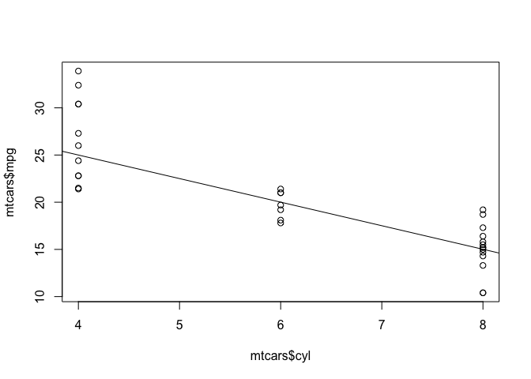

Walk Before Running
================
Brandon Farr
2021-01-08

This is a simple English sentence.

``` r
head(mtcars)
```

    ##                    mpg cyl disp  hp drat    wt  qsec vs am gear carb
    ## Mazda RX4         21.0   6  160 110 3.90 2.620 16.46  0  1    4    4
    ## Mazda RX4 Wag     21.0   6  160 110 3.90 2.875 17.02  0  1    4    4
    ## Datsun 710        22.8   4  108  93 3.85 2.320 18.61  1  1    4    1
    ## Hornet 4 Drive    21.4   6  258 110 3.08 3.215 19.44  1  0    3    1
    ## Hornet Sportabout 18.7   8  360 175 3.15 3.440 17.02  0  0    3    2
    ## Valiant           18.1   6  225 105 2.76 3.460 20.22  1  0    3    1

``` r
mean(mtcars$mpg)
```

    ## [1] 20.09

What if I want to see a plot?

``` r
plot(mtcars$cyl, mtcars$mpg)
abline(35, -5/2)
```

<!-- -->
